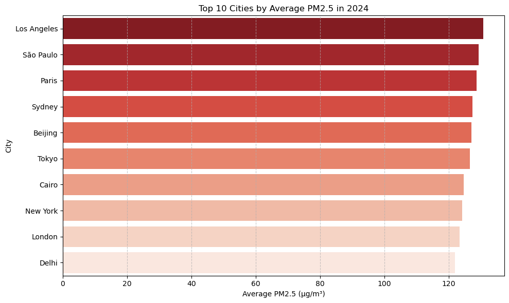
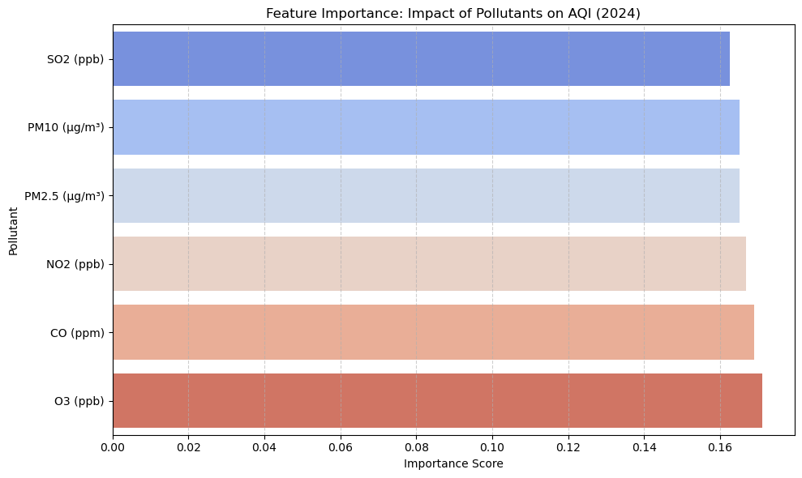
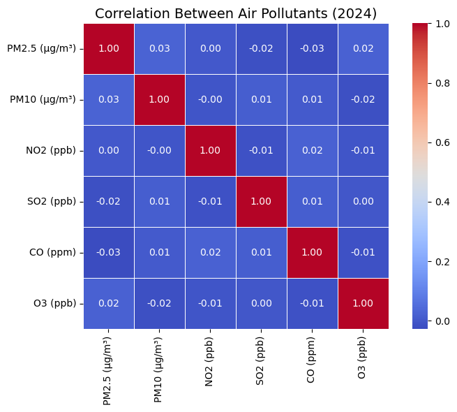

# Impact of Air Pollution on Public Health

This project investigates how air pollution affects public health across major global cities.  
Using **2024 air quality data** combined with health impact indicators, the study analyzes pollutant levels, visualizes patterns, and applies **machine learning** to predict health outcomes.  
The goal is to identify the cities and pollutants most strongly linked to **respiratory, cardiovascular, and hospital-related health risks**, providing insights that could inform future policy and public health decisions.

---

## 📊 Project Overview
- **Pollutants analyzed:** PM2.5, PM10, NO₂, SO₂, CO, O₃  
- **Weather factors included:** Temperature, humidity, wind speed  
- **Health outcomes predicted:**  
  - Respiratory cases  
  - Cardiovascular cases  
  - Hospital admissions  

- **Techniques used:**  
  - Data cleaning & preprocessing  
  - Exploratory data analysis (EDA)  
  - Correlation analysis (Pearson, Spearman)  
  - Random Forest Regression models  
  - Health Burden Index (HBI) development  

---

## 📈 Key Results
- **Paris, Tokyo, São Paulo, and Sydney** ranked among the highest for pollution-linked health burden.  
- **PM2.5 and NO₂** emerged as dominant contributors to health risks.  
- **O₃ (ozone)** also proved highly influential in driving respiratory and cardiovascular outcomes.  
- The **Health Burden Index (HBI)** provided a composite ranking of cities, with **Paris** topping hospital admissions and overall health burden.  

---

## 📑 Reports & Deliverables
- [Final Report (PDF)](report/Impact_of_Air_Pollution_on_Public_Health.pdf)  

---

## 📊 Sample Visualizations

### Top 10 Cities by Average PM2.5 (2024)


### Feature Importance: Impact of Pollutants on AQI


### Top 10 Cities by Health Burden Index (HBI)


---

## 📈 Dataset
- **Files:**  
  - `global_air_quality_dataset.csv`  
  - `air_quality_health_impact_data.csv`  
- **Sources:**  
  - [Kaggle: Global Urban Air Quality Index Dataset (2015–2025)](https://www.kaggle.com/datasets/syedmtalhahasan/global-urban-air-quality-index-dataset-2015-2025)  
  - [World Health Organization – Air Pollution Factsheet](https://www.who.int/health-topics/air-pollution)  

---

## 🛠️ Tools & Libraries
- **Python:** pandas, numpy, matplotlib, seaborn, scikit-learn  
- **Environments:** Jupyter Notebook, Google Colab  
- **Documentation:** Word, PDF, PowerPoint  

---

## 📚 Key Learnings
- Strengthened skills in handling **multi-source datasets** (pollution, weather, health indicators).  
- Applied **correlation methods** (Pearson, Spearman) to real-world health data.  
- Built a **Random Forest regression model** to predict health outcomes with good accuracy.  
- Designed a **Health Burden Index (HBI)** to compare cities, turning raw data into actionable insights.  

---

## 📑 How to Run
### Option 1 — Google Colab
1. Upload `air_pollution_health_analysis.ipynb` and the two CSVs.  
2. Run all cells in sequence.  

### Option 2 — Local Jupyter
1. Install dependencies:  
   ```bash
   pip install pandas numpy matplotlib seaborn scikit-learn
